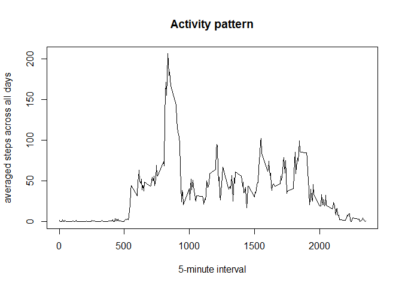

# Reproducible Research: Peer Assessment 1


## Loading and preprocessing the data
I use read.csv to load the data from the activity.csv file with specifying the column classes.

```r
data <- read.csv("activity.csv", colClasses = c("integer", "Date", "integer"))
```


## What is mean total number of steps taken per day?
###Calculate the total number of steps taken per day
I try to use dplyr libray to group daily total steps

```r
library(dplyr)
```

```
## 
## Attaching package: 'dplyr'
## 
## The following object is masked from 'package:stats':
## 
##     filter
## 
## The following objects are masked from 'package:base':
## 
##     intersect, setdiff, setequal, union
```

```r
totalsteps<- data %>% group_by(date) %>% summarize(totalsteps = sum(steps))
totalsteps
```

```
## Source: local data frame [61 x 2]
## 
##          date totalsteps
## 1  2012-10-01         NA
## 2  2012-10-02        126
## 3  2012-10-03      11352
## 4  2012-10-04      12116
## 5  2012-10-05      13294
## 6  2012-10-06      15420
## 7  2012-10-07      11015
## 8  2012-10-08         NA
## 9  2012-10-09      12811
## 10 2012-10-10       9900
## ..        ...        ...
```
### Make a histogram of the total number of steps taken each day
In order to observe the distribution of the total steps per day, I draw the 
histogram of the total steps per day.


```r
library(ggplot2)
ggplot(totalsteps, aes(totalsteps)) + geom_histogram(binwidth = 250) + 
labs(title = "Total steps per day distribution") 
```

 

###Mean and median of the total number of steps taken per day


```r
mean <- as.integer(round(mean(totalsteps$totalsteps, na.rm =TRUE)))
median <- median(totalsteps$totalsteps, na.rm =TRUE)
```
The mean of total number of steps taken per day is 10766.
The median of total number of steps taken per day is  10765

## What is the average daily activity pattern?
###Time series plot
In order to observe daily activity, I make a time series plot.

```r
intervalsteps <- data %>% group_by(interval) %>% 
     summarize(averagesteps = mean(steps, na.rm =TRUE))
plot(intervalsteps$interval, intervalsteps$averagesteps, type = "l", 
     xlab="5-minute interval", ylab = "averaged steps across all days", main = "Activity pattern")
```

 

### 5-minute interval contains the maximum number of steps
I also observe which interval contains the maximum number of steps.

```r
max <- intervalsteps[which.max(intervalsteps$averagesteps),]
max.interval <- max$interval
max.steps <- max$averagesteps
```
As you can see from the diagram, the 5-minute interval which contains the maximum number of step is 835 interval. This interval contains
206.1698113 steps.

## Imputing missing values
### Total number of missing values in the dataset
I found there are a lot of NA in the steps column, but there is no NA in date and interval column.  
I decide to calculate how many missing values in the dataset.

```r
missing.num<- sum(is.na(data$steps))
```
There are 2304 rows with NA in the dataset

### A strategy for filling in all of the missing values
I decide to use mean for that 5-minute interval to fill in the missing values.

###Create a new dataset that is equal to the original dataset but with the missing data filled in.

```r
newdata <- data %>% group_by(interval) %>% mutate(steps =  
ifelse(is.na(steps),intervalsteps[which(intervalsteps$interval == interval[1]),]$averagesteps,
       steps))
```

###total number of steps taken each day

```r
totalsteps<- newdata %>% group_by(date) %>% summarize(totalsteps = sum(steps))
ggplot(totalsteps, aes(totalsteps)) + geom_histogram(binwidth = 250) + 
labs(title = "Total steps per day distribution after imputing missing values") 
```

 

```r
mean <- as.integer(round(mean(totalsteps$totalsteps, na.rm =TRUE)))
median <- median(totalsteps$totalsteps, na.rm =TRUE)
```
The mean of total number of steps taken per day after imputing missing value is 10766.  
The median of total number of steps taken per day after imputing missing value is  1.0766189\times 10^{4}  
Compared this histogram with the previous histogram without imputing missing data, I found the distribution has changed . The maximun count in this histogram is 9, but the maximum count in previous histogram is 4.  
The impacting of imputing missing data will lead to increase the total daily steps.


## Are there differences in activity patterns between weekdays and weekends?

###Create a new factor variable in the dataset with two levels
We create a new column named day with two label: weekday and weekend

```r
Sys.setlocale("LC_TIME", "US")
```

```
## [1] "English_United States.1252"
```

```r
data$day <-factor(1* (weekdays(data$date) != "Sunday" & 
            weekdays(data$date)!= "Saturday"), labels = c("weekend", "weekday"))
```

###panel plot grouped by weekend and weekday label

```r
week.data<- data %>% group_by(day,interval) %>% summarize(averagesteps = mean(steps, na.rm =TRUE))
library(lattice)
xyplot( averagesteps ~ interval|day, data = week.data, layout = c(1, 2), 
        type = "l", ylab = "Number of steps")
```

 
